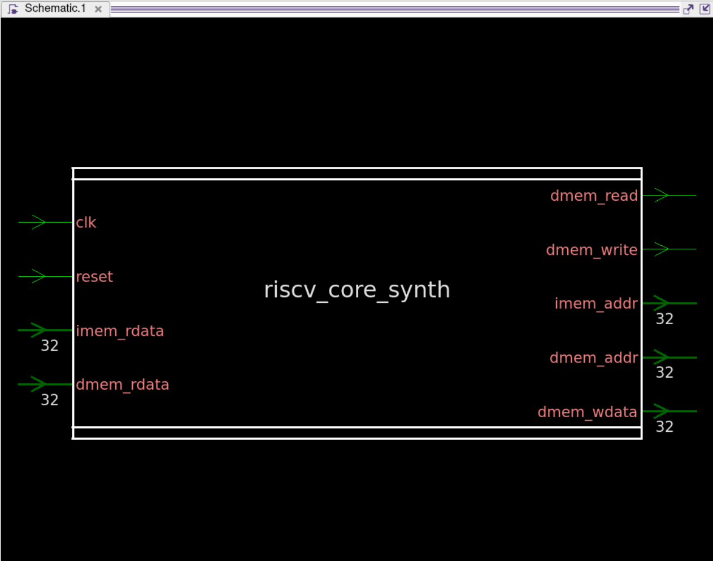
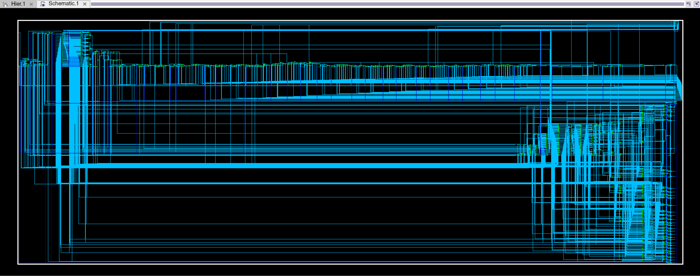
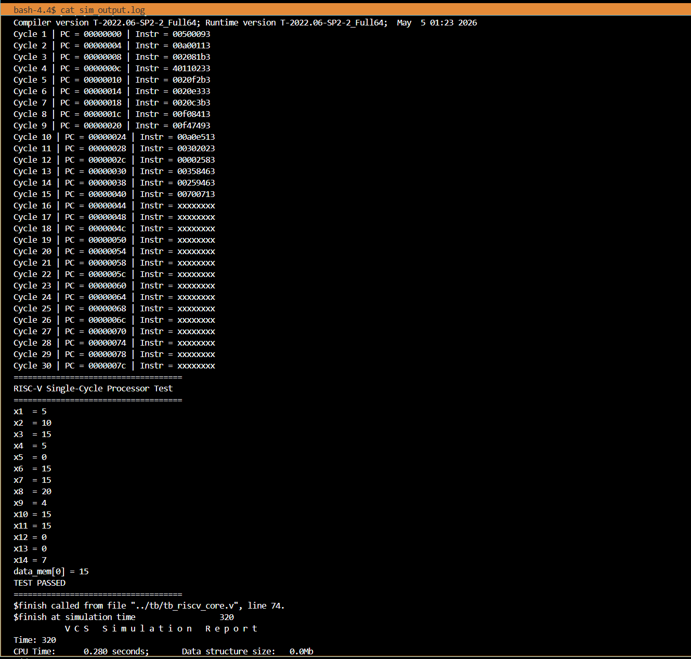
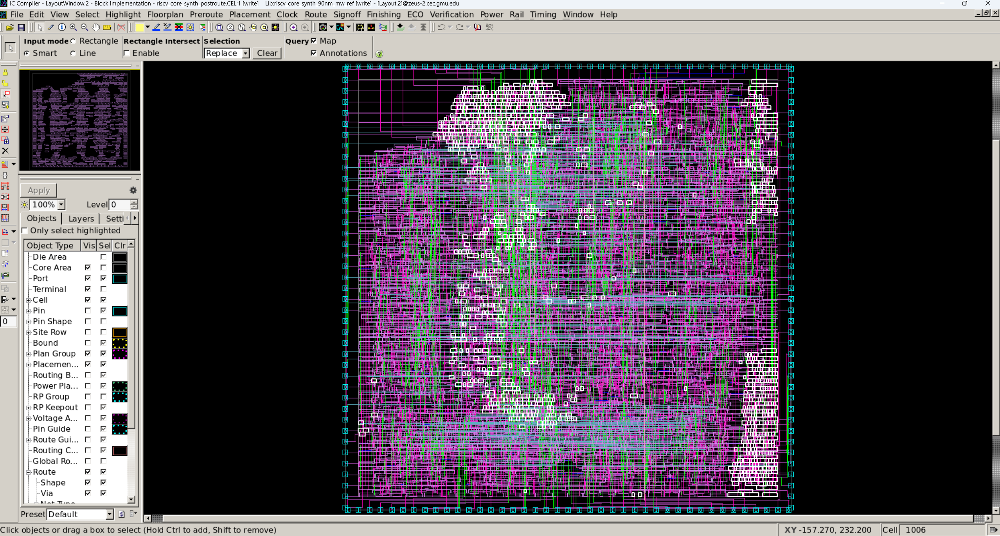
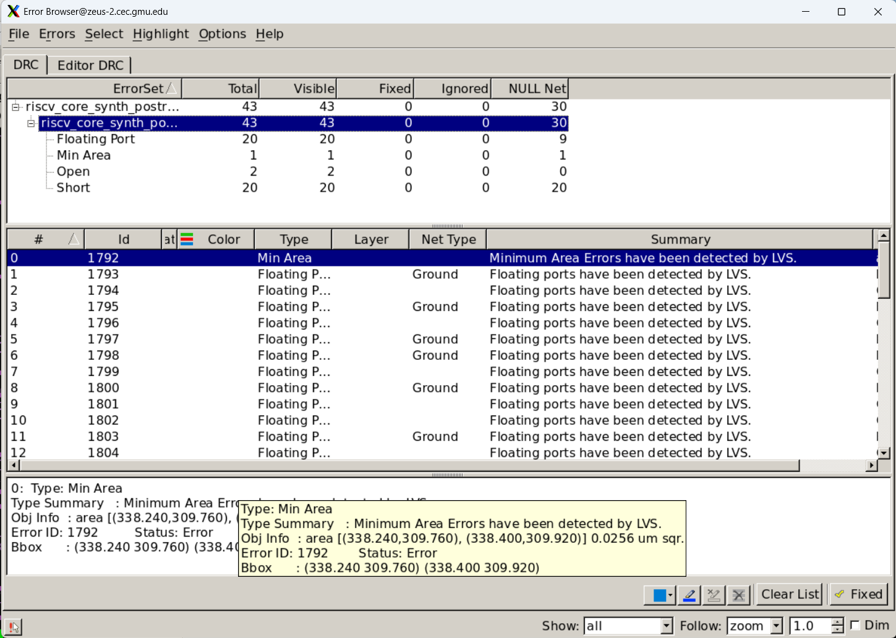

# RISC-V 32-bit Single-Cycle Processor ASIC Implementation

This project implements and analyzes a RISC-V 32-bit Single-Cycle Processor using a complete ASIC design flow. The design was verified using RTL simulation, synthesized using Synopsys Design Compiler, analyzed using PrimeTime, and implemented through backend layout generation using IC Compiler.

## Project Overview

The objective of this project was to evaluate the ASIC implementation efficiency of a RISC-V 32-bit Single-Cycle Processor across two standard-cell technology nodes:

- SAED90nm
- SAED32nm

The project compares key ASIC metrics such as:

- Maximum frequency
- Area
- Power
- Timing slack
- Power Delay Product (PDP)
- Power Delay Area Product (PDAP)
- Latency
- Throughput

## Processor Architecture

The processor is a single-cycle RISC-V core where each instruction completes in one clock cycle.

Major modules include:

- Program Counter
- Register File
- ALU
- Control Unit
- Immediate Generator
- Branch Logic
- Instruction Memory Interface
- Data Memory Interface

The processor supports arithmetic, logical, memory access, and control-flow operations.

## Core Schematic

Top-level synthesized schematic of the RISC-V processor core:



Internal synthesized schematic view:



## ASIC Design Flow

The project follows the standard ASIC design flow:

```text
Verilog RTL
   ↓
VCS RTL Simulation
   ↓
Design Compiler Synthesis
   ↓
PrimeTime Static Timing Analysis
   ↓
IC Compiler Backend Layout
   ↓
SPEF / GDS / LVS Analysis
```

## Tools Used

- Synopsys VCS
- Synopsys Design Compiler
- Synopsys PrimeTime
- Synopsys IC Compiler
- SAED90nm standard-cell library
- SAED32nm standard-cell library

## RTL Simulation Output

The RTL simulation was performed using Synopsys VCS. The simulation verified correct instruction execution before synthesis.



## Front-End Results

### SAED90nm Results

| Design Case | Clock Period | Frequency | Area | Power | PDP |
|---|---:|---:|---:|---:|---:|
| Best Frequency | 17 ns | 58.82 MHz | 71035.085 µm² | 1.1246 mW | 19.1182 pJ |
| Lowest Area | 30 ns | 33.33 MHz | 68916.327 µm² | 1.0643 mW | 31.9290 pJ |
| 1.25× Area Limit | 17 ns | 58.82 MHz | 71035.085 µm² | 1.1246 mW | 19.1182 pJ |
| 1.5× Area Limit | 17 ns | 58.82 MHz | 71035.085 µm² | 1.1246 mW | 19.1182 pJ |

### SAED32nm Results

| Design Case | Clock Period | Frequency | Area | Power | PDP |
|---|---:|---:|---:|---:|---:|
| Best Frequency | 5 ns | 200 MHz | 16652.023 µm² | 0.5171 mW | 2.5855 pJ |
| Lowest Area | 30 ns | 33.33 MHz | 15151.303 µm² | 0.4085 mW | 12.2550 pJ |
| 1.25× Area Limit | 5 ns | 200 MHz | 16652.023 µm² | 0.5171 mW | 2.5855 pJ |
| 1.5× Area Limit | 5 ns | 200 MHz | 16652.023 µm² | 0.5171 mW | 2.5855 pJ |

## Technology Comparison

The SAED32nm implementation achieved better results compared to SAED90nm.

| Metric | SAED90nm Best Frequency | SAED32nm Best Frequency |
|---|---:|---:|
| Clock Period | 17 ns | 5 ns |
| Frequency | 58.82 MHz | 200 MHz |
| Area | 71035.085 µm² | 16652.023 µm² |
| Power | 1.1246 mW | 0.5171 mW |
| PDP | 19.1182 pJ | 2.5855 pJ |
| PDAP | 1358062.968 pJ·µm² | 43053.806 pJ·µm² |

The SAED32nm implementation achieved the best overall front-end result with the lowest PDP and PDAP.

## Backend Implementation

The highest-frequency SAED90nm design was selected for backend implementation using IC Compiler.

Backend flow completed:

- Floorplanning
- Placement
- Routing
- RC extraction
- SPEF generation
- GDS generation
- LVS error analysis

### Backend Results

| Metric | Value |
|---|---:|
| Technology | SAED90nm |
| Clock Period | 17 ns |
| Post-route Slack | +10.76 ns |
| Leaf Cell Count | 4828 |
| Post-route Area | 69933.773 µm² |
| Dynamic Power | 286.6972 µW |
| Leakage Power | 1.0242 mW |
| GDS File Size | 4.9 MB |
| LVS Errors | 43 total |

## Final Layout

Final post-route layout generated using Synopsys IC Compiler for the SAED90nm highest-frequency design.



## LVS Error Analysis

LVS was run after routing in IC Compiler. The LVS error browser reported 43 total errors.



## Generated Outputs

The project includes:

- RTL Verilog files
- Testbench files
- RTL simulation output
- Front-end synthesis reports
- PrimeTime timing reports
- Backend IC Compiler reports
- Post-route Verilog
- SPEF files
- GDS file
- Layout screenshot
- LVS error screenshot

## Key Findings

- SAED32nm achieved the highest frequency: 200 MHz.
- SAED90nm achieved a maximum frequency of 58.82 MHz.
- SAED32nm had significantly lower area and power.
- The lowest PDP was achieved by the SAED32nm 5 ns design.
- The lowest PDAP was also achieved by the SAED32nm 5 ns design.
- The SAED90nm backend flow successfully generated post-route `.v`, `.spef`, and `.gds` files.

## Repository Structure

```text
.
├── rtl/                      # RTL Verilog source files
├── tb/                       # Testbench files
├── programs/                 # Test programs / instruction files
├── docs/                     # Project screenshots and summaries
├── Simulation_Results/       # RTL simulation output
└── Results_front_end/        # Synthesis, timing, and backend reports
```

## Conclusion

This project demonstrates a complete ASIC implementation and analysis flow for a RISC-V 32-bit Single-Cycle Processor. The design was successfully verified, synthesized, timing-analyzed, and implemented through backend layout generation.

The comparison between SAED90nm and SAED32nm shows that the smaller SAED32nm technology provides major improvements in frequency, area, power efficiency, PDP, and PDAP.
